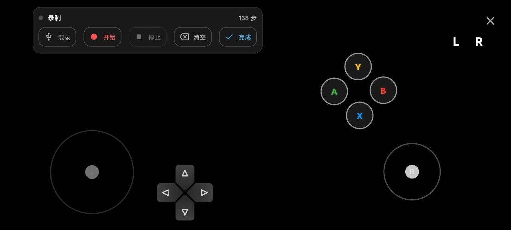

# Virtual Gamepad Pro

[](https://pub.dev/packages/virtual_gamepad_pro)
[](https://github.com/XiaoNaoWeiSuo/flutter_virtual_keyboard/blob/main/LICENSE)

A pure-Flutter virtual controller suite (Joystick / D-Pad / Buttons / Mouse / Keyboard / Macros) with a runtime layout editor.

This package cleanly separates:
- **Definition**: bindings, styles, semantics (owned by your app code)
- **State**: editable runtime data like position/size/opacity/config (portable JSON)

So you can:
- Share and persist only the minimal JSON state (no callbacks, no business logic, no platform objects)
- Keep bindings and visual rules strongly typed (no implicit `String + Map` conventions)
- Control performance (less dynamic inference, fewer runtime maps)

Coordinate system: every control uses normalized percentage coordinates (0.0–1.0) for both position and size, so layouts are resolution-independent.

---

## Highlights
- Overlay renderer: render `definition + state` with predictable performance
- Runtime layout editor: drag / resize / opacity; saves a minimal `VirtualControllerState` JSON
- Strong typed input: `InputBinding` for keyboard & gamepad; supports registering custom buttons
- Theme layer: `VirtualControlTheme` can override style/layout/label/config at render-time without mutating original data
- Macro suite: record, edit, and serialize an `InputEvent` sequence to power macro buttons

---

## Screenshots

| Layout Editor | Macro Editor |
|---|---|
|  |  |

| Macro Recorder (dock) | Keyboard Control |
|---|---|
|  |  |

Gamepad Buttons


Editor Signals (examples)

| Button Edit Signal | Joystick Edit Signal |
|---|---|
|  |  |

---

## Install

```yaml
dependencies:
  virtual_gamepad_pro: ^0.3.0
```

---

## Quick Start (Render Overlay: definition + state)

Recommended data model:
- `VirtualControllerLayout`: control definition (binding/style/default layout, owned by code)
- `VirtualControllerState`: user-editable state (layout/opacity/config only, JSON-friendly)

```dart
import 'package:flutter/material.dart';
import 'package:virtual_gamepad_pro/virtual_gamepad_pro.dart';

class GamePage extends StatelessWidget {
  const GamePage({super.key});

  @override
  Widget build(BuildContext context) {
    final definition = VirtualControllerLayout(
      schemaVersion: 1,
      name: 'Default',
      controls: [
        VirtualJoystick(
          id: 'ls',
          label: 'LS',
          layout: const ControlLayout(x: 0.1, y: 0.6, width: 0.2, height: 0.2),
          trigger: TriggerType.hold,
          mode: JoystickMode.gamepad,
          stickType: GamepadStickId.left,
        ),
        VirtualButton(
          id: 'btn_a',
          label: 'A',
          layout: const ControlLayout(x: 0.8, y: 0.7, width: 0.1, height: 0.1),
          trigger: TriggerType.tap,
          binding: const GamepadButtonBinding(GamepadButtonId.a),
        ),
      ],
    );

    final state = const VirtualControllerState(schemaVersion: 1, controls: []);

    return Scaffold(
      body: Stack(
        children: [
          const Center(child: Text('Game Content')),
          VirtualControllerOverlay(
            definition: definition,
            state: state,
            onInputEvent: (event) {
              if (event is GamepadAxisInputEvent) {
                debugPrint('Axis ${event.axisId}: ${event.x}, ${event.y}');
              } else if (event is GamepadButtonInputEvent) {
                debugPrint('Button ${event.button}: ${event.isDown}');
              } else if (event is KeyboardInputEvent) {
                debugPrint('Key ${event.key}: ${event.isDown}');
              }
            },
          ),
        ],
      ),
    );
  }
}
```

---

## Example App (for pub.dev)

This repository includes a complete example app (layout management + runtime editor + macro entry points):
- Directory: `example/`
- Entry: `example/lib/main.dart`

---

## Theming (Recommended): `VirtualControlTheme`

Themes are meant to decorate at render-time, not to rewrite your source data.
You can treat a theme as a pure function: `VirtualControl -> VirtualControl`.

```dart
final theme = RuleBasedVirtualControlTheme(
  base: const DefaultVirtualControlTheme(),
  post: [
    ControlRule(
      when: ControlMatchers.gamepadButtonId(GamepadButtonId.a),
      transform: (c) => (c as VirtualButton).copyWith(
        style: const ControlStyle(color: Colors.green),
      ),
    ),
  ],
);

VirtualControllerOverlay(
  definition: definition,
  state: state,
  theme: theme,
  onInputEvent: onInputEvent,
);
```

---

## Add Custom Gamepad Buttons: `InputBindingRegistry`

Register a strongly-typed custom button (e.g. Turbo / Screenshot / OEM keys) before building your layout/editor palette:

```dart
void main() {
  InputBindingRegistry.registerGamepadButton(code: 'turbo', label: 'Turbo');
  InputBindingRegistry.registerGamepadButton(code: 'screenshot', label: 'Shot');
  runApp(const MyApp());
}
```

---

## Layout Serialization Guide

### Goals & constraints
- **Shareable & persistable**: serialized data must not contain callbacks, platform objects, or business semantics
- **Cross-device reuse**: coordinates are normalized (0.0–1.0), avoiding resolution coupling
- **Evolvable**: `schemaVersion` supports structure evolution

### Two-layer model: Definition vs State
- **Definition**: `VirtualControllerLayout` (control types, bindings, styles, default layout)
- **State**: `VirtualControllerState` (user-editable layout/opacity/config)

Core rule: **Definition is controlled by code; State is the minimal data you persist/share.**

### Minimal State JSON (recommended)

```json
{
  "schemaVersion": 1,
  "name": "My Layout",
  "controls": [
    {
      "id": "btn_a",
      "layout": { "x": 0.78, "y": 0.63, "width": 0.12, "height": 0.12 },
      "opacity": 0.7
    }
  ]
}
```

### Render-time merge behavior (important)
- During rendering, `VirtualControlState.config` is merged into each control's config; some controls (e.g. macro buttons) also apply label/sequence fields.
- If `state` contains control IDs that do not exist in `definition`, the renderer may attempt best-effort completion by ID prefix (useful for migration/replay).

This enables sharing only `state` while still restoring a usable layout, with definition-level style/binding owned by your app.

---

## API Notes

### `VirtualControllerOverlay`
Renderer entry point (`definition + state`).

| Property | Type | Description |
|----------|------|-------------|
| `definition` | `VirtualControllerLayout` | Control definitions (bindings/styles/default layout). |
| `state` | `VirtualControllerState` | Editable runtime state (layout/opacity/config), JSON-friendly. |
| `onInputEvent` | `Function(InputEvent)` | Input event callback. |
| `opacity` | `double` | Global overlay opacity (0.0–1.0). |
| `showLabels` | `bool` | Whether to show text labels on controls. |
| `immersive` | `bool` | Hide system UI (status/navigation) with immersive mode. |

### `VirtualControllerLayoutEditor`
Runtime layout editor: edits only `state` (position/size/opacity); does not mutate bindings/styles/actions.

| Property | Type | Description |
|----------|------|-------------|
| `layoutId` | `String` | Unique ID for the layout being edited. |
| `loadDefinition` | `Future<VirtualControllerLayout> Function(id)` | Load definition (owned by code). |
| `loadState` | `Future<VirtualControllerState> Function(id)` | Load state (JSON). |
| `saveState` | `Future<void> Function(id, state)` | Persist state (JSON). |
| `previewDecorator` | `Function` | Optional hook to decorate preview (e.g. apply theme). |
| `immersive` | `bool` | Immersive mode. |

### Macro recording & editing
For normal runtime rendering you only need `VirtualControllerOverlay`. Macro workflows are opt-in tooling:

- `MacroSuitePage`: macro editor (main editor + quick record importer). Updates macro button data (stored in `VirtualControllerState.controls[].config['recordingV2']`).
- `VirtualControllerMacroRecordingSession`: record input events (optionally mixing real keyboard/mouse), then returns a `recordingV2` JSON list (each item includes `atMs`) for visual editing.
- `VirtualControllerMacroRecorder`: a recorder page widget with a top-left recording dock (useful for debugging / custom entry points). For a clean renderer-only UI, prefer `VirtualControllerOverlay`.

### `ControlStyle`
Visual appearance of a control.

| Property | Type | Description |
|----------|------|-------------|
| `shape` | `BoxShape` | `circle` or `rectangle`. |
| `color` | `Color?` | Background color. |
| `borderColor` | `Color?` | Border color. |
| `lockedColor` | `Color?` | Color for "locked" state (e.g. joystick lock). |
| `backgroundImagePath` | `String?` | Asset path or URL for background image. |
| `shadows` | `List<BoxShadow>` | Shadow list for neon/glow effects. |
| `imageFit` | `BoxFit` | How the image should be inscribed. |

### `VirtualJoystick`
A virtual thumbstick.

| Property | Type | Description |
|----------|------|-------------|
| `deadzone` | `double` | Minimum input value to register (0.0–1.0). Default: 0.1. |
| `stickType` | `String` | `'left'` or `'right'` (event ID). |
| `mode` | `String` | `'keyboard'` (WASD keys) or `'gamepad'` (axis events). |

### `VirtualButton`
A standard push button.

| Property | Type | Description |
|----------|------|-------------|
| `trigger` | `TriggerType` | `tap` (press/release), `hold` (continuous), `doubleTap`. |
| `label` | `String` | Text displayed on the button. |
| `binding` | `InputBinding` | Strong-typed binding for emitted input. |

#### Ultra strong typed helper

```dart
final GamepadButtonId id = button.gamepadButton; // throws if not gamepad
final GamepadButtonId? maybe = button.gamepadButtonOrNull;
```

---

## Layout Editor Integration

To use the editor, implement the persistence layer (load/save).

```dart
// Example using SharedPreferences
Future<void> saveState(String id, VirtualControllerState state) async {
  final prefs = await SharedPreferences.getInstance();
  final jsonStr = jsonEncode(state.toJson());
  await prefs.setString('layout_state_$id', jsonStr);
}

Future<VirtualControllerState> loadState(String id) async {
  final prefs = await SharedPreferences.getInstance();
  final jsonStr = prefs.getString('layout_state_$id');
  if (jsonStr == null) {
    return const VirtualControllerState(schemaVersion: 1, controls: []);
  }
  return VirtualControllerState.fromJson(jsonDecode(jsonStr));
}

Future<VirtualControllerLayout> loadDefinition(String id) async {
  return VirtualControllerLayout.xbox();
}

// In your Widget:
VirtualControllerLayoutEditor(
  layoutId: 'user_custom_1',
  loadDefinition: loadDefinition,
  loadState: loadState,
  saveState: saveState,
)
```

Notes:
- The editor palette automatically lists registered custom buttons.

---

## License

MIT License. See [LICENSE](LICENSE) for details.

---

## Built in Production


This package was extracted from a real production need: a highly customizable, editable, serializable (shareable) virtual controller + macro system with predictable performance. If you're building game streaming, remote control, cloud apps, or tool-like products, it should help you ship interaction faster.

- Company: Hangzhou iLingJing Technology Co., Ltd.
- Product: [QianPC](https://www.qianpc.com)
- Author: [liliin.icu](https://liliin.icu)
