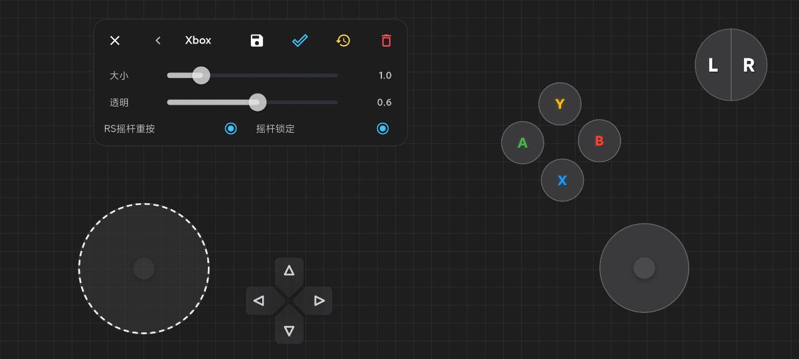
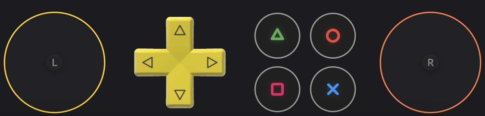
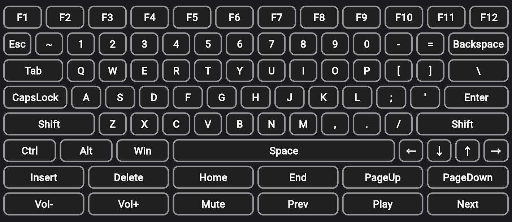
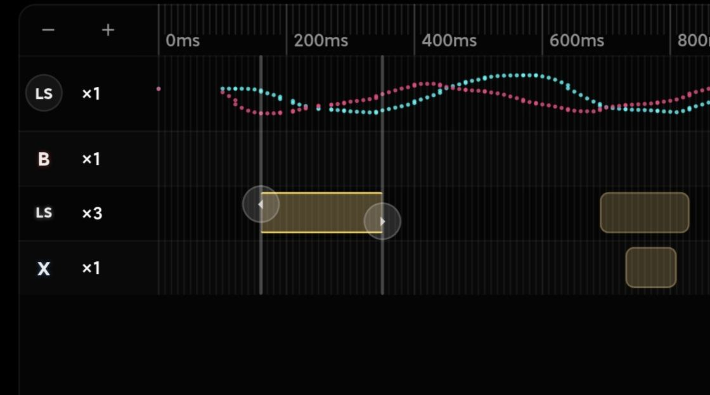
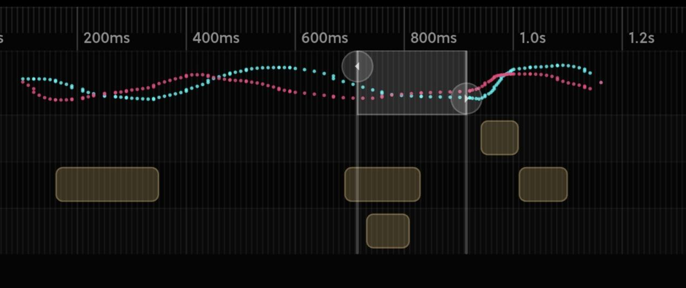

# Virtual Gamepad Pro

[](https://pub.dev/packages/virtual_gamepad_pro)
[](https://github.com/XiaoNaoWeiSuo/flutter_virtual_keyboard/blob/main/LICENSE)

一个纯 Flutter 的虚拟控制器组件库（Joystick / D-Pad / Buttons / Mouse 等），附带运行时布局编辑器。

这个插件把“**控件定义**”（按键绑定、样式、业务语义）与“**可编辑状态**”（位置/大小/透明度）分离，便于：
- 只把可分享的数据存成 JSON（不会携带绑定/回调/业务语义）
- 业务侧用代码统一控制样式与输入绑定
- 运行时渲染只做必要计算（少字符串推断/少动态 Map）

> 坐标体系：所有控件的位置与大小均采用百分比坐标 (0.0 - 1.0)，可跨分辨率复用布局数据。

---

## 插件功能效果介绍
- 纯 Flutter 虚拟控制器组件库：Joystick / D-Pad / Buttons / Mouse / Keyboard / Macro 等
- 内置运行时布局编辑器：拖拽 / 缩放 / 透明度，保存为最小化 `VirtualControllerState` JSON（跨分辨率复用）
- 输入强类型：`InputBinding`（键盘/手柄），支持注册自定义按钮，避免 `String + Map` 的隐式约定
- 主题定制：`VirtualControlTheme` 允许在渲染时批量覆盖 style/layout/label/config（不污染原始 definition/state）

| 布局编辑器 | 宏编辑器（动图） |
|---|---|
|  |  |

| 手柄按钮展示 | 键盘控件展示 |
|---|---|
|  |  |

编辑器信号（示例）：




---

## 插件接入及使用方法&按钮主题如何定制以及新增

### 安装

```yaml
dependencies:
  virtual_gamepad_pro: ^0.3.0
```

### 快速上手：渲染 Overlay（definition + state）

建议把布局拆成两层：
- `VirtualControllerLayout`：控件定义（binding/style/默认 layout 等，业务代码控制）
- `VirtualControllerState`：用户可编辑状态（只包含 position/size/opacity/config，可序列化分享）

```dart
import 'package:flutter/material.dart';
import 'package:virtual_gamepad_pro/virtual_gamepad_pro.dart';

class GamePage extends StatelessWidget {
  const GamePage({super.key});

  @override
  Widget build(BuildContext context) {
    final definition = VirtualControllerLayout(
      schemaVersion: 1,
      name: 'Default',
      controls: [
        VirtualJoystick(
          id: 'ls',
          label: 'LS',
          layout: const ControlLayout(x: 0.1, y: 0.6, width: 0.2, height: 0.2),
          trigger: TriggerType.hold,
          mode: JoystickMode.gamepad,
          stickType: GamepadStickId.left,
        ),
        VirtualButton(
          id: 'btn_a',
          label: 'A',
          layout: const ControlLayout(x: 0.8, y: 0.7, width: 0.1, height: 0.1),
          trigger: TriggerType.tap,
          binding: const GamepadButtonBinding(GamepadButtonId.a),
        ),
      ],
    );

    final state = const VirtualControllerState(schemaVersion: 1, controls: []);

    return Scaffold(
      body: Stack(
        children: [
          const Center(child: Text('Game Content')),
          VirtualControllerOverlay(
            definition: definition,
            state: state,
            onInputEvent: (event) {
              if (event is GamepadAxisInputEvent) {
                debugPrint('Axis ${event.axisId}: ${event.x}, ${event.y}');
              } else if (event is GamepadButtonInputEvent) {
                debugPrint('Button ${event.button}: ${event.isDown}');
              } else if (event is KeyboardInputEvent) {
                debugPrint('Key ${event.key}: ${event.isDown}');
              }
            },
          ),
        ],
      ),
    );
  }
}
```

### Example（pub 展示用示例）

仓库内置了一个完整的示例 App（布局管理 + 运行时编辑器 + 宏录制/编辑入口），发布到 pub 后会在页面 Example 选项卡展示：
- 目录：`example/`
- 入口：`example/lib/main.dart`

### 按钮主题如何定制：VirtualControlTheme（推荐做法）

主题的目标是“渲染时装饰”，而不是改写原始数据：你可以把主题当作一个纯函数 `VirtualControl -> VirtualControl`。

```dart
final theme = RuleBasedVirtualControlTheme(
  base: const DefaultVirtualControlTheme(),
  post: [
    ControlRule(
      when: ControlMatchers.gamepadButtonId(GamepadButtonId.a),
      transform: (c) => (c as VirtualButton).copyWith(
        style: const ControlStyle(color: Colors.green),
      ),
    ),
  ],
);

VirtualControllerOverlay(
  definition: definition,
  state: state,
  theme: theme,
  onInputEvent: onInputEvent,
);
```

### 按钮如何新增：自定义手柄按钮（InputBindingRegistry）

```dart
void main() {
  InputBindingRegistry.registerGamepadButton(code: 'turbo', label: 'Turbo');
  InputBindingRegistry.registerGamepadButton(code: 'screenshot', label: 'Shot');
  runApp(const MyApp());
}
```

---

## 布局序列化反序列化白皮书

### 目标与约束
- **可分享/可落盘**：序列化的数据不包含回调、业务语义、平台对象
- **跨设备复用**：坐标与尺寸用百分比（0.0 - 1.0），避免分辨率耦合
- **可演进**：通过 `schemaVersion` 管理数据结构升级

### 两层数据模型：Definition vs State
- **Definition（定义）**：`VirtualControllerLayout`（控件类型、输入绑定、样式、默认 layout 等）
- **State（状态）**：`VirtualControllerState`（用户可编辑信息：layout/opacity/config）

核心原则：**Definition 由代码控制；State 才是你要保存/分享的最小数据**。

### State JSON 最小化规范（建议）

```json
{
  "schemaVersion": 1,
  "name": "My Layout",
  "controls": [
    {
      "id": "btn_a",
      "layout": { "x": 0.78, "y": 0.63, "width": 0.12, "height": 0.12 },
      "opacity": 0.7
    }
  ]
}
```

### 渲染合并策略（重要）
- 渲染时会把 `VirtualControlState.config` 合并进控件 config，并对部分控件（如宏按键）应用 label/sequence 等字段
- 当 state 中存在“definition 没有的控件 id”时，会尝试按 id 前缀动态补全控件（便于迁移与回放）

这意味着：你可以只分享 state，接收端也能尽可能“还原可用布局”，而高级样式/业务绑定仍由 Definition 兜底控制。

---

## 📚 API Documentation (API 文档)

### 1. `VirtualControllerOverlay`
渲染器入口（definition + state）。

| Property | Type | Description (CN) |
|----------|------|------------------|
| `definition` | `VirtualControllerLayout` | 控件定义（binding/style/默认 layout 等）。 |
| `state` | `VirtualControllerState` | 可编辑状态（仅 position/size/opacity，适合 JSON 分享）。 |
| `onInputEvent` | `Function(InputEvent)` | Callback for receiving input events. (输入事件回调) |
| `opacity` | `double` | Global opacity of the overlay (0.0 - 1.0). (全局透明度) |
| `showLabels` | `bool` | Whether to show text labels on controls. (是否显示标签) |
| `immersive` | `bool` | Hide system UI (status/navigation) with immersive mode. (沉浸式全屏) |

### 2. `VirtualControllerLayoutEditor`
运行时布局编辑器：只编辑 state（位置/大小/透明度），不会修改 binding/style/actions。

| Property | Type | Description (CN) |
|----------|------|------------------|
| `layoutId` | `String` | Unique ID for the layout being edited. (布局ID) |
| `loadDefinition` | `Future<VirtualControllerLayout> Function(id)` | 加载控件定义（代码控制）。 |
| `loadState` | `Future<VirtualControllerState> Function(id)` | 加载 state（JSON）。 |
| `saveState` | `Future<void> Function(id, state)` | 保存 state（JSON）。 |
| `previewDecorator` | `Function` | Optional hook to modify layout before preview (e.g. apply themes). (预览装饰器) |
| `immersive` | `bool` | Hide system UI (status/navigation) with immersive mode. (沉浸式全屏) |

### 3. 宏录制与宏编辑

正常“运行时渲染”只需要 `VirtualControllerOverlay`。  
宏相关的录制/编辑属于“工具能力”，只在你显式进入宏编辑/录制流程时出现。

#### `MacroSuitePage`
宏编辑器（主体编辑 + 录制快速录入工具）。用于编辑一段可回放的 `InputEvent` 序列，并最终生成/更新宏按键的数据（写入 `VirtualControllerState.controls[].config['recordingV2']`）。支持 `immersive` 沉浸式全屏。

#### `VirtualControllerMacroRecordingSession`
宏录制会话页：进入当前布局渲染器录制输入事件（可配置混录真实键盘/鼠标），完成后返回一段 `recordingV2` JSON 列表供宏编辑器可视化编辑（每条事件带 `atMs`）。

#### `VirtualControllerMacroRecorder`
一个“带左上角录制 Dock”的录制页面组件（用于调试或你自己做录制入口）。  
如果你把它当成正常渲染器来用，左上角会一直显示录制 Dock；如果你只想渲染控制器，请使用 `VirtualControllerOverlay`。

### 3. `ControlStyle`
Defines the visual appearance of a control.

| Property | Type | Description (CN) |
|----------|------|------------------|
| `shape` | `BoxShape` | `circle` or `rectangle`. (形状) |
| `color` | `Color?` | Background color. (背景色) |
| `borderColor` | `Color?` | Border color. (边框色) |
| `lockedColor` | `Color?` | Color when control is in "locked" state (e.g. joystick lock). (锁定状态颜色) |
| `backgroundImagePath` | `String?` | Asset path or URL for background image. (背景图路径) |
| `shadows` | `List<BoxShadow>` | Shadow list for neon/glow effects. (阴影列表) |
| `imageFit` | `BoxFit` | How the image should be inscribed. (图片填充模式) |

### 4. `VirtualJoystick`
A virtual thumbstick.

| Property | Type | Description (CN) |
|----------|------|------------------|
| `deadzone` | `double` | Minimum input value to register (0.0 - 1.0). Default: 0.1. (死区) |
| `stickType` | `String` | `'left'` or `'right'`. Determines the event ID. (摇杆类型) |
| `mode` | `String` | `'keyboard'` (WASD keys) or `'gamepad'` (axis events). (模式) |

### 5. `VirtualButton`
A standard push button.

| Property | Type | Description (CN) |
|----------|------|------------------|
| `trigger` | `TriggerType` | `tap` (press/release), `hold` (continuous), `doubleTap`. (触发类型) |
| `label` | `String` | Text displayed on the button. (标签文本) |
| `binding` | `InputBinding` | Strong-typed binding for emitted input. (强类型绑定) |

#### 5.1 Ultra Strong Typed Helper (极致强类型辅助)

```dart
final GamepadButtonId id = button.gamepadButton; // throws if not gamepad
final GamepadButtonId? maybe = button.gamepadButtonOrNull;
```

---

## 🧩 Layout Editor Integration (布局编辑器接入)

To use the editor, you must implement the persistence layer (load/save).
要使用编辑器，您必须实现持久化层（加载/保存）。

```dart
// Example using SharedPreferences
Future<void> saveState(String id, VirtualControllerState state) async {
  final prefs = await SharedPreferences.getInstance();
  final jsonStr = jsonEncode(state.toJson());
  await prefs.setString('layout_state_$id', jsonStr);
}

Future<VirtualControllerState> loadState(String id) async {
  final prefs = await SharedPreferences.getInstance();
  final jsonStr = prefs.getString('layout_state_$id');
  if (jsonStr == null) {
    return const VirtualControllerState(schemaVersion: 1, controls: []);
  }
  return VirtualControllerState.fromJson(jsonDecode(jsonStr));
}

Future<VirtualControllerLayout> loadDefinition(String id) async {
  return VirtualControllerLayout.xbox();
}

// In your Widget:
VirtualControllerLayoutEditor(
  layoutId: 'user_custom_1',
  loadDefinition: loadDefinition,
  loadState: loadState,
  saveState: saveState,
)
```

### Custom Gamepad Buttons (自定义手柄按钮)

如果你希望支持额外按钮（例如 Turbo/截屏/OEM 键），在代码中先注册一个强类型按钮 ID，然后把它用于你的 definition（以及编辑器调色板）。

```dart
void main() {
  InputBindingRegistry.registerGamepadButton(code: 'turbo', label: 'Turbo');
  InputBindingRegistry.registerGamepadButton(code: 'screenshot', label: 'Shot');
  runApp(const MyApp());
}
```

Notes:
- The editor palette will automatically show registered custom buttons.

---

## 📄 License

MIT License. See [LICENSE](LICENSE) for details.

---

## 广告时间（来自产品一线的插件）


这个插件并不是“为了做一个插件而做的插件”，它诞生于真实产品研发过程：我们需要一套可高度定制、可编辑、可序列化分享、并且性能可控的虚拟控制器与宏系统，于是把它沉淀成了这个开源包。希望它也能帮你在游戏串流 / 远程控制 / 云应用 / 工具类产品里更快落地交互方案。

- 公司：杭州爱灵境科技有限公司
- 产品官网：https://www.qianpc.com
- 我的主页：https://liliin.icu
